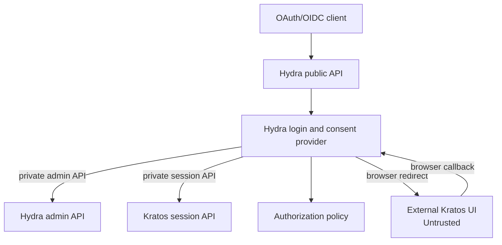

# Hydra Kratos Login Consent

[](https://github.com/KroderDev/hydra-kratos-login-consent/actions/workflows/ci.yml)
[](https://github.com/KroderDev/hydra-kratos-login-consent/blob/main/go.mod)
[](https://codecov.io/gh/KroderDev/hydra-kratos-login-consent)

Generic Go login and consent provider for [Ory Hydra](https://www.ory.sh/hydra/)
and [Ory Kratos](https://www.ory.sh/kratos/).

Hydra delegates end-user authentication and consent to an application. This
project provides that server-side integration while allowing the actual login
and MFA screens to remain in a separate external UI.

## Responsibilities

The service:

- Receive Hydra login and consent challenges.
- Redirect the browser to an external Kratos UI.
- Validate the resulting Kratos session.
- Enforce a configurable authenticator assurance level.
- Apply an application-supplied authorization policy.
- Accept or reject Hydra challenges through the private Hydra admin API.
- Add only approved, application-specific or explicitly mapped OIDC identity claims.

The service does not:

- Store passwords, TOTP secrets, or OAuth provider credentials.
- Replace Kratos, Hydra, or Keto.
- Own application user interfaces.
- Contain customer-specific domains or application-specific policy in its
  generic core.

## Architecture



The external UI is a browser-facing client. It never receives Hydra admin
credentials and is not trusted to make authorization decisions.

## Documentation

- Read the [documentation index](docs/README.md).
- Use the [configuration reference](docs/configuration.md) for every environment
  variable and allowlist shape.
- Use the [deployment contract](docs/deployment.md) for HTTPS, network
  boundaries, browser transactions, state, probes, secrets, and image
  verification.

## Layout

```text
cmd/server/                         composition root and graceful shutdown
internal/core/domain/               provider-owned models and invariants
internal/core/ports/                driving and driven port contracts
internal/core/application/          login, consent, and logout flows
internal/core/config/               validated configuration contract
internal/config/                    environment configuration loader
internal/adapters/inbound/http/     HTTP security boundary
internal/adapters/outbound/         Hydra, Kratos, policy, and state adapters
```

## Configuration

The server reads configuration from environment variables:

| Variable | Purpose |
|---|---|
| `LISTEN_ADDR` | Listen address, default `:8080`. |
| `LOG_LEVEL` | JSON log level, default `info`. |
| `PUBLIC_URL` | Public provider URL. |
| `EXTERNAL_UI_URL` | Configured external login/consent UI URL. |
| `HYDRA_ADMIN_URL` | Private Hydra admin API URL. |
| `HYDRA_PUBLIC_URL` | Hydra public origin used to validate returned redirects. |
| `KRATOS_PUBLIC_URL` | Kratos public session API URL. |
| `KRATOS_SESSION_COOKIE` | Kratos browser cookie name, default `ory_kratos_session`. |
| `REQUIRED_AAL` | Minimum assurance level, default `aal2`. |
| `TRANSACTION_TTL` | Browser transaction lifetime, default `5m`, maximum `15m`. |
| `MAX_PENDING_TRANSACTIONS` | Per-process pending transaction quota, default `10000`. |
| `ALLOWED_CLIENTS` | JSON client, redirect, scope, audience, and claim allowlists. |
| `OIDC_IDENTITY_CLAIM_MAPPINGS` | Optional JSON mappings from sanitized Kratos traits/metadata to OIDC claims. |
| `ALLOWED_SUBJECTS` | Comma-separated subjects for the static policy adapter. |
| `ALLOWED_SUBJECT_SCOPES` | JSON subject/client/scope rules for static policy; required in secure environments only when `POLICY_BACKEND=static`. |
| `POLICY_BACKEND` | Policy backend, `static` by default or `http`. |
| `POLICY_URL` | Complete versioned HTTP policy endpoint when `POLICY_BACKEND=http`. |
| `POLICY_AUTH_TOKEN` | Runtime bearer credential for the HTTP policy backend; required in secure HTTP policy deployments. |
| `HYDRA_ADMIN_TOKEN` | Runtime bearer token for Hydra admin requests; required in secure environments. |
| `STATE_STORE` | Transaction store, `memory` by default or `redis`; secure environments require `redis`. |
| `REDIS_URL` | Redis/Valkey connection URL when `STATE_STORE=redis`; secure environments require `rediss://`. |
| `REDIS_KEY_PREFIX` | Redis key prefix; required and environment-specific for Redis in secure environments. |
| `ENVIRONMENT` | `development` or `test` permit local transports; other values require secure production settings. |

The application defaults to the in-memory store when `STATE_STORE` is unset. Use
`.env.example` for a Redis-backed local setup; Redis/Valkey is required for
replicas and production deployments.

`ALLOWED_CLIENTS` must include exact redirect URI and scope allowlists. Example:

```json
{
  "example-client": {
    "allowed_redirect_uris": ["https://client.example/callback"],
    "allowed_post_logout_redirect_uris": ["https://client.example/"],
    "allowed_scopes": ["openid", "profile"],
    "allowed_audiences": ["example-api"]
  }
}
```

All configured redirect URIs, post-logout redirect URIs, scopes, audiences, and
claims are exact allowlists; wildcards and inferred clients are not supported.
Identity claim mappings are opt-in, use exact RFC 6901 JSON Pointers, and are
described in the [configuration reference](docs/configuration.md#identity-claim-mappings).
With `POLICY_BACKEND=static`, `ALLOWED_SUBJECT_SCOPES` is required outside
development and test. With `POLICY_BACKEND=http`, `POLICY_URL` and its
server-side bearer credential are required in secure environments instead;
`ALLOWED_SUBJECT_SCOPES` is not used. See the [configuration reference](docs/configuration.md)
for the complete policy and allowlist contract.

See [the remote policy contract](docs/policy-contract.md) for request,
response, authentication, timeout, and fail-closed behavior.

## Development

Run the checks directly or through the Makefile targets:

```text
gofmt -w .
go test ./...
go test -tags=integration -count=1 ./...
go test -race ./...
go vet ./...
golangci-lint run ./...
govulncheck ./...
```

The integration suite is the provider's end-to-end contract. It drives the
public HTTP handler and real Hydra, Kratos, policy, and Redis adapters against
isolated HTTP and Redis fixtures. Run it with `make e2e`; it is also required
in CI. `make e2e-docker` runs the same contract against a pinned Redis
container on localhost through Docker host networking on Linux; set
`E2E_REDIS_URL` when running the suite against a shared test Redis. Live Hydra
and Kratos container tests remain deployment-level tests and must use pinned
service images and runtime configuration.

## Container Image

Build the production image with:

```sh
docker build --tag hydra-kratos-login-consent:local .
```

The image runs as a non-root user and contains only the compiled server and
runtime certificates. Configuration and secrets must be supplied at runtime;
they are not copied into the image. For a production deployment, set
`ENVIRONMENT=production`, use HTTPS URLs, set `STATE_STORE=redis` with a
`rediss://` `REDIS_URL`, and provide the required Hydra, Kratos, UI, client,
and policy configuration.

The container listens on port `8080` by default. Its Docker healthcheck calls
`/healthz`; orchestration readiness probes should call `/readyz`. Readiness
checks Hydra and Kratos and also Redis/Valkey when `STATE_STORE=redis`; it does
not call the HTTP policy endpoint. The release workflow publishes verified
multi-architecture images to GHCR. Deployments must pin the published digest
and verify its Cosign signature, SPDX SBOM, and SLSA provenance. See the
[image release and verification guide](docs/release.md) and the
[deployment image contract](docs/deployment.md#image-supply-chain).

## License

Apache License 2.0. See [LICENSE](LICENSE).
