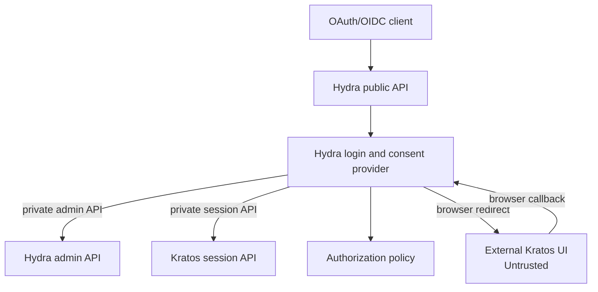

# Hydra Kratos Login Consent

Generic Go login and consent provider for [Ory Hydra](https://www.ory.sh/hydra/)
and [Ory Kratos](https://www.ory.sh/kratos/).

Hydra delegates end-user authentication and consent to an application. This
project provides that server-side integration while allowing the actual login
and MFA screens to remain in a separate external UI.

## Responsibilities

The service:

- Receive Hydra login and consent challenges.
- Redirect the browser to an external Kratos UI.
- Validate the resulting Kratos session.
- Enforce a configurable authenticator assurance level.
- Apply an application-supplied authorization policy.
- Accept or reject Hydra challenges through the private Hydra admin API.
- Add only approved, application-specific token claims.

The service does not:

- Store passwords, TOTP secrets, or OAuth provider credentials.
- Replace Kratos, Hydra, or Keto.
- Own application user interfaces.
- Contain customer-specific domains or application-specific policy in its
  generic core.

## Architecture



The external UI is a browser-facing client. It never receives Hydra admin
credentials and is not trusted to make authorization decisions.

## Documentation

- Read the [full documentation](docs/README.md), including requirements,
  architecture, trust boundaries, and the HTTP contract.

## Layout

```text
cmd/server/                         composition root and graceful shutdown
internal/core/domain/               provider-owned models and invariants
internal/core/ports/                driving and driven port contracts
internal/core/application/          login, consent, and logout flows
internal/core/config/               validated configuration contract
internal/config/                    environment configuration loader
internal/adapters/inbound/http/     HTTP security boundary
internal/adapters/outbound/         Hydra, Kratos, policy, and state adapters
```

## Configuration

The server reads configuration from environment variables:

| Variable | Purpose |
|---|---|
| `PUBLIC_URL` | Public provider URL. |
| `EXTERNAL_UI_URL` | Configured external login/consent UI URL. |
| `HYDRA_ADMIN_URL` | Private Hydra admin API URL. |
| `HYDRA_PUBLIC_URL` | Hydra public origin used to validate returned redirects. |
| `KRATOS_PUBLIC_URL` | Kratos public session API URL. |
| `KRATOS_SESSION_COOKIE` | Kratos browser cookie name, default `ory_kratos_session`. |
| `REQUIRED_AAL` | Minimum assurance level, default `aal2`. |
| `TRANSACTION_TTL` | Browser transaction lifetime, default `5m`. |
| `ALLOWED_CLIENTS` | JSON client and scope allowlist. |
| `ALLOWED_SUBJECTS` | Comma-separated subjects for the local policy adapter. |
| `HYDRA_ADMIN_TOKEN` | Optional runtime bearer token for Hydra admin requests. |
| `STATE_STORE` | Transaction store, `memory` by default or `redis`. Production requires `redis`. |
| `REDIS_URL` | Redis/Valkey connection URL when `STATE_STORE=redis`. |
| `REDIS_KEY_PREFIX` | Optional Redis key prefix, default `transaction:`. |
| `ENVIRONMENT` | Set to `production` to reject the local memory store. |

The application defaults to the in-memory store when `STATE_STORE` is unset. Use
`.env.example` for a Redis-backed local setup; Redis/Valkey is required for
replicas and production deployments.

`ALLOWED_CLIENTS` must include exact redirect URI and scope allowlists. Example:

```json
{
  "example-client": {
    "allowed_redirect_uris": ["https://client.example/callback"],
    "allowed_post_logout_redirect_uris": ["https://client.example/"],
    "allowed_scopes": ["openid", "profile"]
  }
}
```

## Development

Run the checks directly or through the Makefile targets:

```text
gofmt -w .
go test ./...
go test -tags=integration -count=1 ./...
go test -race ./...
go vet ./...
golangci-lint run ./...
govulncheck ./...
```

The integration suite is the provider's end-to-end contract. It drives the
public HTTP handler and real Hydra, Kratos, policy, and Redis adapters against
isolated HTTP and Redis fixtures. Run it with `make e2e`; it is also required
in CI. `make e2e-docker` runs the same contract against a pinned Redis
container on localhost through Docker host networking on Linux; set
`E2E_REDIS_URL` when running the suite against a shared test Redis. Live Hydra
and Kratos container tests remain deployment-level tests and must use pinned
service images and runtime configuration.

## License

Apache License 2.0. See [LICENSE](LICENSE) and [NOTICE](NOTICE).
