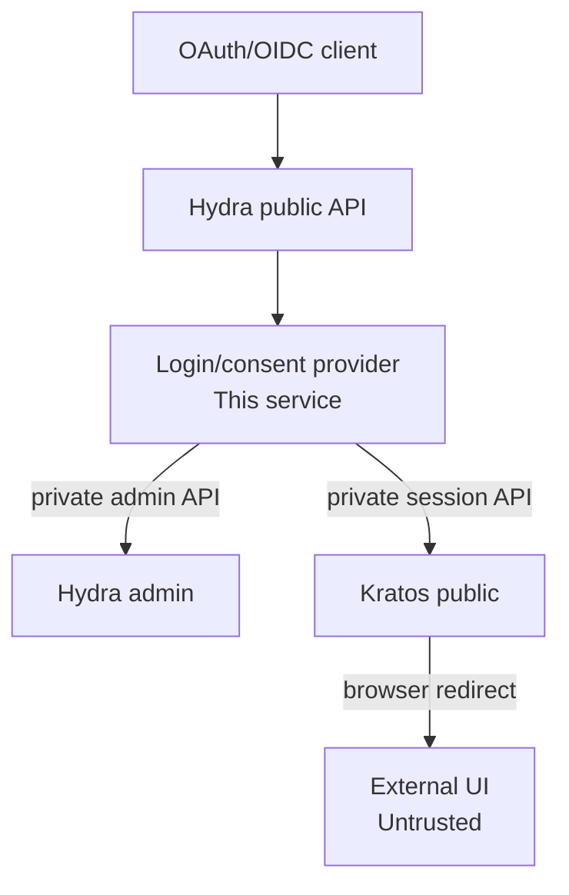

# Architecture And Trust Boundaries

## System Context

## Trust Model

The service is trusted to complete Hydra login and consent challenges. The
external UI is not trusted with protocol authority or authorization policy.

The service must independently validate:

- The Hydra challenge.
- The OAuth client and requested redirect URI.
- The external UI transaction state.
- The Kratos session.
- The required authenticator assurance level.
- The authorization policy for the client and requested scopes.

The browser may carry cookies and opaque transaction handles, but it must never
carry Hydra admin credentials or policy decisions that the service accepts
without verification.

## Component Responsibilities

### Hydra

- OAuth2 and OpenID Connect protocol endpoints.
- Authorization code, access token, refresh token, and ID token issuance.
- OAuth client registration and protocol state.
- Signing keys and issuer metadata.

### Kratos

- Identity records and external provider links.
- GitHub and Google authentication.
- TOTP and other MFA methods.
- Browser sessions and authenticator assurance.

### External UI

- Login, registration, settings, recovery, and MFA screens.
- Browser interaction with the Kratos public API.
- Redirecting the browser back to this service after the flow.

### This Service

- Hydra login and consent provider behavior.
- Server-side Kratos session validation.
- Client, redirect URI, and scope policy.
- Application-specific authorization policy integration.
- Token claim construction.

## Go Structure

The implementation is a modular hexagonal service with dependencies pointing
toward the core:

- `internal/core/domain` contains provider-owned models and invariants.
- `internal/core/ports` contains the driving provider port and small driven
  capability interfaces consumed by the application.
- `internal/core/application` contains the login, consent, logout, and
  readiness use cases.
- `internal/core/config` contains the validated configuration contract used by
  the core; `internal/config` only loads it from environment variables.
- `internal/adapters/inbound/http` maps browser requests to the driving port and
  never calls Ory admin APIs directly.
- `internal/adapters/outbound` contains Hydra, Kratos, state, and policy
  implementations of driven ports.
- `cmd/server` is the composition root and performs manual constructor wiring.

The core does not import HTTP, Ory clients, environment access, or concrete
storage. Adapters depend on core ports and domain types; the composition root is
the only place that selects concrete implementations.

The service does not use a relational database or gRPC. Its only application
state is short-lived browser transaction state, which is currently implemented
in memory for tests and local development. Release deployments use a shared
Redis/Valkey adapter for transaction state and replica-safe operation.

## Deployment Boundary

This service is designed to run as a containerized, stateless Kubernetes
workload. Kubernetes deployment resources, service configuration, and container
packaging belong to the deployment layer and remain separate from the
application core.

Kubernetes deployments should follow these boundaries:

- Run multiple replicas behind a Kubernetes `Service` with the shared
  Redis/Valkey transaction store.
- Provide non-secret settings through environment-backed `ConfigMap` values.
- Provide Hydra credentials and other secrets through Kubernetes `Secret`
  values; never expose them to the browser-facing UI.
- Configure `/healthz` as the liveness probe and `/readyz` as the readiness
  probe.
- Route only the documented browser-facing HTTP endpoints through the ingress.
- Keep Hydra admin and Kratos admin endpoints private and reachable only through
  cluster network policy.
- Set a termination grace period that allows the HTTP server's graceful
  shutdown timeout to complete.
- Use rolling updates and readiness gating so traffic is not sent to a pod
  before Hydra and Kratos dependencies are ready.

The in-memory transaction store remains suitable only for local development and
tests. It must not be used with multiple Kubernetes replicas or in a release
deployment.

Hydra admin and Kratos admin endpoints must remain private network services.
Only the explicitly required browser-facing endpoints may be exposed through an
ingress or gateway.
