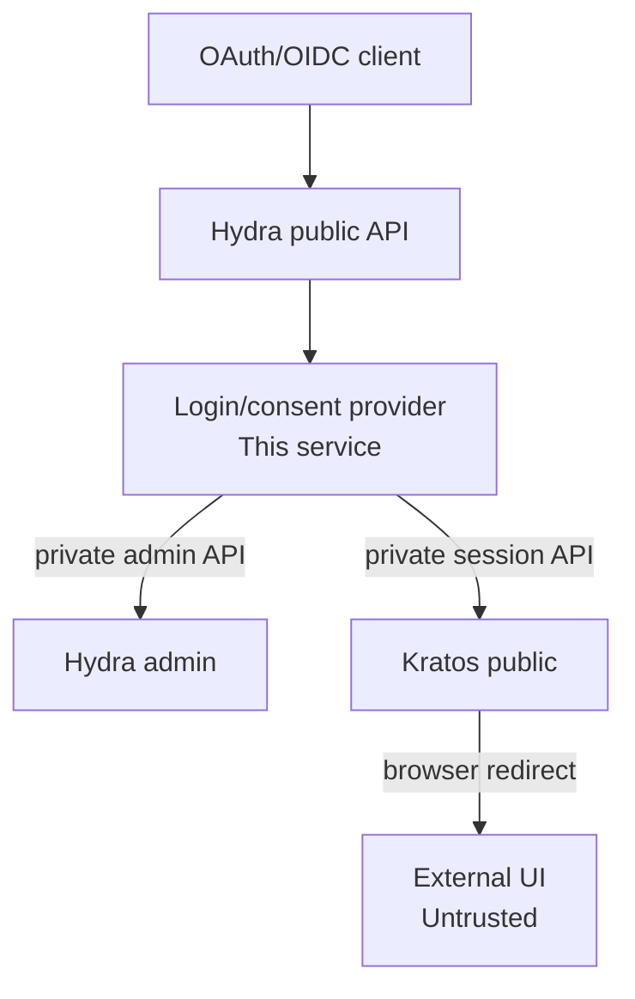

# Architecture And Trust Boundaries

## System Context

## Trust Model

The service is trusted to complete Hydra login and consent challenges. The
external UI is not trusted with protocol authority or authorization policy.

The service must independently validate:

- The Hydra challenge.
- The OAuth client and requested redirect URI.
- The external UI transaction state.
- The provider-issued browser-state cookie bound to that transaction.
- The Kratos session.
- The required authenticator assurance level.
- The authorization policy for the client, requested scopes, and audiences.

The browser may carry cookies and opaque transaction handles, but it must never
carry Hydra admin credentials or policy decisions that the service accepts
without verification.

## Component Responsibilities

### Hydra

- OAuth2 and OpenID Connect protocol endpoints.
- Authorization code, access token, refresh token, and ID token issuance.
- OAuth client registration and protocol state.
- Signing keys and issuer metadata.

### Kratos

- Identity records and external provider links.
- GitHub and Google authentication.
- TOTP and other MFA methods.
- Browser sessions and authenticator assurance.

### External UI

- Login, registration, settings, recovery, and MFA screens.
- Browser interaction with the Kratos public API.
- Redirecting the browser back to this service after the flow.

### This Service

- Hydra login and consent provider behavior.
- Server-side Kratos session validation.
- Client, redirect URI, and scope policy.
- Browser-bound login, consent, and logout handoffs.
- Application-specific authorization policy integration.
- Application policy claim filtering and opt-in OIDC identity claim construction.

## Go Structure

The implementation is a modular hexagonal service with dependencies pointing
toward the core:

- `internal/core/domain` contains provider-owned models and invariants.
- `internal/core/ports` contains the driving provider port and small driven
  capability interfaces consumed by the application.
- `internal/core/application` contains the login, consent, logout, and
  readiness use cases.
- `internal/core/config` contains the validated configuration contract used by
  the core; `internal/config` only loads it from environment variables.
- `internal/adapters/inbound/http` maps browser requests to the driving port and
  never calls Ory admin APIs directly.
- `internal/adapters/outbound` contains Hydra, Kratos, state, and policy
  implementations of driven ports. Policy has a static adapter for local use
  and an HTTP adapter for the versioned remote authorization contract.
- `cmd/server` is the composition root and performs manual constructor wiring.

The composition root selects the policy adapter from `POLICY_BACKEND`. The
core only receives the abstract policy port; HTTP contract types and bearer
credentials remain at the outbound adapter boundary.

The core does not import HTTP, Ory clients, environment access, or concrete
storage. Adapters depend on core ports and domain types; the composition root is
the only place that selects concrete implementations.

The service does not use a relational database or gRPC. Its only application
state is short-lived browser transaction state, which is currently implemented
in memory for tests and local development. The Redis/Valkey outbound adapter
stores serialized transactions with expiry and atomically consumes them for
release deployments and replica-safe operation. The application also applies a
bounded pending-transaction quota.

## Deployment Boundary

This service is designed to run as a containerized workload with shared
transaction state when deployed outside local development. The deployment
runtime, service discovery, network policy, TLS front door, and container
packaging belong to the deployment layer and remain separate from the
application core. The contract is platform-neutral; Kubernetes is one example
of a runtime that can implement it.

Every multi-replica or release deployment must use the shared Redis/Valkey
transaction store. The in-memory store remains suitable only for local
development and tests. Hydra admin and Kratos administrative endpoints must
remain private network services, and only explicitly required browser-facing
provider endpoints may be exposed through an ingress, gateway, or equivalent
edge.

## Identity Claim Boundary

The Kratos adapter retains only the identity's JSON `traits` and
`metadata_public` objects in the transient `domain.Session`. It does not retain
the full identity response, admin metadata, credentials, or browser
credentials, and neither identity object is added to `domain.Transaction` or
Redis. After consent policy approval, the core applies the configured exact RFC
6901 mappings and standard OIDC scope/type checks. The resulting claims are
then filtered independently for ID tokens and access tokens using the client's
existing allowlists. No identity claim is copied to an access token without an
explicit access-token allowlist entry.

Any deployment runtime should provide non-secret settings through its ordinary
configuration mechanism, inject Hydra, policy, and Redis credentials through
its secret mechanism, use `/healthz` for liveness and `/readyz` for readiness,
and allow the HTTP server's graceful shutdown timeout to complete. Readiness
checks Hydra and Kratos and also checks Redis/Valkey when the Redis state store
is configured; it does not probe the remote policy endpoint.

For the complete runtime contract, including HTTPS, browser transactions,
secret redaction, image verification, and a Kubernetes example, see
[deployment.md](deployment.md).
